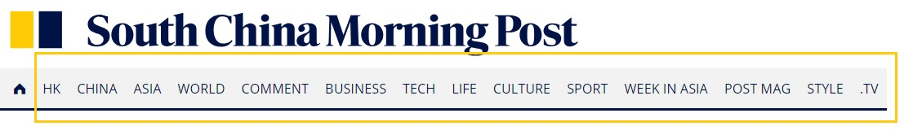
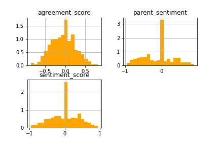
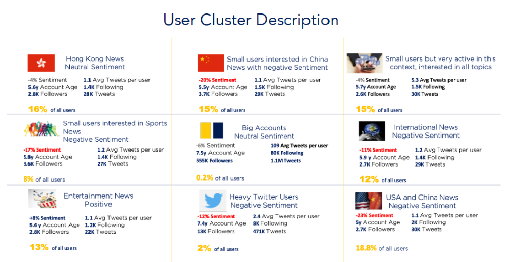
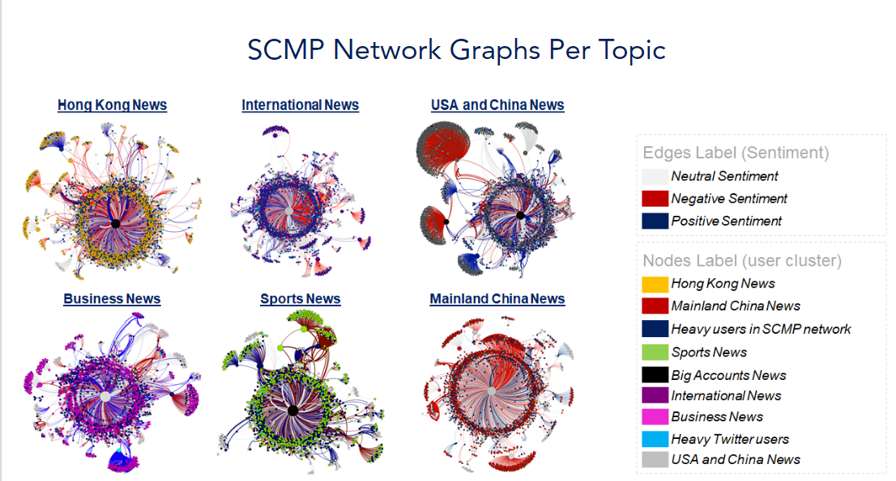

This article was developed based on the final project for a Social Media Analytics Course in the University of Hong Kong's Master of Science in Business Analytics programme. The project is a result of a team effort and everybody worked hard to deliver all analysis that are going to be presented in this document. I would like to say thank you to all my team mates: August Hjorth, Maria Raquel Gomez Lopez, Martina de Luca, Xiaoyen Chen and Mawuli Adjei.<br>
  Later, Mawuli and I decided to use the project content to publish some articles that could be useful for other persons that are planning to develop similar studies. This will be the first of five different articles based in that project:<br>
<br>
- [Summary report](https://): In this article we focus on insights obtained through the analysis and its application to business. It works as a summary, without going too deep into technical aspects. Since we are students in a Business Analytics programme, we decided that it would be interesting to show a little of how analytics tools can be applied to give insights to business and support data drive strategies.    
- [Topic Model](https://): In this article we are going to show in more detail how we used algorithms to perform topic modeling. It will be more technical and focused on a step by step break down of our R-script.  
- [Sentiment Analysis](https://): Again, this will be more technical article, focused both on the sentiment analysis and agreement analysis.   
- [User Cluster](https://): Similar to the Topic Modeling article, in this one we are going to focus on the User Cluster Development.    
- [Social Networks Analysis with Gephi](https://): In this article we are going to explore basic Social Network concepts and give a brief introduction to Gephi.
<br>

# Introduction

The online newspaper sector has been through a lot of rapid change due to the emergence of social media. Many agencies, like South China Morning Post (SCMP), have switched up and adopted new online and social strategies to attract online audience and increase revenue.<br>

The South China Morning Post was established in Hong Kong in 1903 by Tse Tsan-Tai and Alfred Cunningham and published its first newspaper in English on November 6th 1903. Nowadays, it became one of the most important news portal in Hong Kong, being acquired by Alibaba in 2015. It set out as a global media company that reports mainly about Hong Kong and mainland China to an international audience.<br>

We decided to analyse SCMP because they are one of the most competitive newspaper in broadcasting news from China to the rest of the word. Besides that, they are very active on Twitter since this social media platform is part of their strategy to increase engagement and subsequently their profit.<br>

This newspaper produces content that covers multiple topics such as business, technology, and lifestyle. In order to achieve its mission of becoming the bridge of communication between Asia and the world,  SCMP went through a series of transformations in 2018 that has allowed them to reach a broader audience.<br>

In this project we analyzed the Twitter data from SCMP aiming to understand its Social Media Network. Our goal was to  understand how the Twitter Users on SCMP's account behave and then find opportunities on how SCMP can capitalize on its social media strategy.

This article is divided in the following sections:    
- Data Extraction and Transformation   
- Tools   
- Overview   
- The alternative approach   
- Social Network graphs  
- Conclusion   
- Recomendation   
- Resources   

# Data Extraction and Transformation 

To extract the data from Twitter, we used the package `rtweet` and the search term "SCMPNews". The data was extracted three times during the period from Dec/18 to Jan/19:<br>  
- First Extraction: December 18th, 2018 <br>
- Second Extraction: December 25th, 2018 <br>
- Third Extraction: January 1st, 2019 <br>

Each of those extractions brings in average the last seven days data.  Therefore, the resulting data was merged, duplicated tweets were excluded and finally we were able to collect data from 12/10/2018 to 01/01/2019.<br>
Besides that, from the data extracted, the team broke it down into three different component files that were used in the further analysis. These files are: <br>  
- Vertex data: File with information about the user account like number of friends, number of tweets, account language and others.<br> 
- Edge data: File with user's relationship trough tweets, like: retweet, reply, mention and others.<br>
- Tweet Data: Is the original file extract using the Twitter API.<br>

# Tools

For our analysis, we identified the following software options to develop our analysis:<br>
- R <br>
- NodeXL <br>
- Gephi <br>
- Python <br>
NodeXL had the capability of handling most of the social network analysis we wanted to do however, due to its limitations as an Excel plug-in in handling large amounts of data, we ended up adopting only R, Python and Gephi. R was used for data extraction, time-series, topic modeling, natural language processing and cluster analysis. Python was used for data wrangling, and sentiment analysis under natural language processing. And lastly, Gephi was used to perform social network analysis based on the extracted data.   

```{r, include=FALSE}
library(tidyverse)
library(dplyr)
library(tidytext) 
library(tm) 
library(ggplot2)
library(plotly)
library(wordcloud) 
library(igraph)
library(ggraph)
library(RColorBrewer)
library(ggpubr)
#library(gridExtra)
#library(topicmodels)
#library(rtweet)
#library(cluster)

setwd("C:/Users/gcmou/Documents/GitHub/Twitter_template")
tweet <- read.csv("SCMPNews_tweet_data_full_new.csv")
tweet$created_at <- as.POSIXct(as.character(levels(tweet$created_at)), format = "%Y-%m-%d %H:%M")[tweet$created_at]
vertice <- read.csv("SCMPNews_vertices_data_full_new.csv")
edge <- read.csv("SCMPNews_edge_data_full_new.csv")
edge$date_created <- as.POSIXct(as.character(levels(edge$date_created)), format = "%d/%m/%Y %H:%M")[edge$date_created]

#As we said earlier our three files are going to be used in this analysis. It is important to remember that even if we only have public data in this file, we decided to anonimize all the data. Sensitive information as screen name were deleted.
#glimpse(tweet)
#glimpse(vertice)
#glimpse(edge)

theme_SCMP <- theme_classic() +
              theme(text=element_text(size = 11, family = "sans", color = "midnightblue"),
              axis.text.y = element_text(colour = "gray48"),
              axis.text.x = element_text(colour = "gray48"))

```

In our final data we had 25.372 uniques tweets, 13.267 users and 50.157 relationships (We only considered tweets in English for this analysis). In average there are 1103 tweets per day in the data, but  we clearly see that on the 18th of December, there was some event that made the amount of tweets increase up to 2000 tweets in total. After some analysis we figured out that the trending topic at that day was the "USA and China Trade war" and you can see more details about this in [Topic Model](https://) article.<br>


```{r, echo=FALSE}
#preparing the data for the visualization: number of tweets per day
time=tweet %>% mutate(day = as.Date(cut(created_at, breaks = "day"))) %>%
      group_by(day) %>% 
      summarise(total = n()) 

time_aux <- tibble::tibble(
      time = seq(as.Date("2018-12-10"), as.Date("2019-01-02"), by = "day"))
time <- left_join(time_aux, time, by = c("time" = "day"))

#using plotly package for a dynamic visualization
plot_ly(time, x = ~time, y = ~total, mode = 'lines', line = list(color = 'rgb(0, 0, 102)', width = 3)) %>%
      add_lines() %>%
      layout(title="Tweets per day") %>%
      rangeslider(time_aux$time[1], time_aux$time[20])


```

# Overview

In this context, we know that SCMP is the primary source of content, so it is reasonable to expect that its social network would be built around its profile. 
However, what we could see from its graph is that the power of this account is so high that is hard to identify relevant sub-networks in its structure. For example, when we compare the betweenness centrality from the top users, we see that the difference between SCMP (top 1) and the other ones is huge (note that this metric is normalized to make easier the comparison):   
   
 
|User^[The users name were anonymized]|Betweenness Centrality|Degree|
|:---:|:---:|:---:|
|Top 1|0.98|6412|
|Top 2|0.12|654|
|Top 3|0.05|298|
|Top 4|0.03|343|
|Top 5|0.02|121|

According to Borgatti et al. (2013)^[Borgatti, S., Everett, M., Johnson, J. 2013. Analyzing Social Networks. 1st ed., SAGE], betweenness centrality "is a measure of how often a given node falls along the shortest path between two other nodes". So, the high value obtained for SCMP node means that its profile is "in the middle" of most conversations (i.e edges). That's why it's difficult to find sub-communities in this network, once most of the relationships are directly related to SCMP.
After running the modularity clustering available in Gephi, we were able to find 21 different communities and the most important ones are highlighted in dark blue, yellow, light blue, red, black, purple and all the other (small) ones are in gray. As one can notice, comparing to the giant component in dark blue where SCMP node is in, none of the others sub-networks have high relevance.   
```{r, out.width='70%', fig.align='center', echo = FALSE}
knitr::include_graphics('img/overview_no_label2.png')
```

# The Alternative Approach

To come up with more insightful analysis, we decided to use an alternative approach by combining topic clustering, user clustering and sentiment analysis to split this giant network into meaningful sub-networks.
For a deeper understanding of those analyses you can go through the following articles: [Topic Model](https://), [User Cluster](https://), [Sentiment Analysis](https://), [Social Network Analysis with Gephi](https://)

## Topic Modelling

As said before, SCMP is a important player in the News sector as such it is always producing content about several different subjects. Those topics are classified in their website as follow:

```{r, out.width='90%', fig.align='center', echo = FALSE}

```

With this said, we decided to identify the naturally occuring topics that were commented in SCMP network. Notice that we are considering not only SCMP posts but also all the other users' tweets, which means that the analysis is broader then just the content that SCMP produces alone.<br>
To achieve this goal, we used a popular topic model algorithm called Latent Dirichlet Allocation (available in `topicmodel` R package), which is an unsupervised machine learning method. As output of this modeling part we got 6 different topics as described below:<br> 
<br>
- **USA and China**: News related to the international relationship between USA and China. This group refers to posts and conversationtions that had special attention to the Trade war issue druing this period. This explains why these words are bigger than the others.    
- **International**: News related to the international scene. In this part of the cloud we can see the name of some countries like "Canada", "Japan" and "India". In this topic the principal news item was related to the arrest of a top Huawei executive in Canada.    
- **Hong Kong News**: In this topic we have many different topic news but all of them happened or had some relationship with Hong Kong.    
- **Mainland China**: News from or about Mainland China. Some of the popular news items in this topic are about a group of Christians that were arrested during this period.   
- **Sports**: In this case the news that generated most engagement were the ones related to some rumors of Japan Olympic games boycott because of the new Japanese police about Whale Hunting.   
- **Business**: General news about business. In this cloud we can see some terms like: "Jack Ma", "CEOs", "wrapping" and "Christmas".   
<br>
Interestingly, we didn't find all the contents that SCMP classify in its website, which means that not all of them produce enough engagement. Probably the non-identified topics reach a very specific kind of user and, comparing to the whole network, it doesn't play a role important enough for us to identify it as an isolated topic.<br>

```{r, echo = FALSE, message = FALSE, warning=FALSE, cache=FALSE}
#selecting the important variables. The topic variable was obtained using the *** function. More details about this modeling part are found in Topic Modelling article. 
aux <- tweet %>% select(status_id, text, created_at, topic)

#cleaning the tweet text
aux$stripped_text <- gsub("http.*","",  aux$text)
aux$stripped_text <- gsub("https.*","", aux$stripped_text)
aux$stripped_text <- gsub('[^\x20-\x7E]', '', aux$stripped_text)

topic1 <- aux %>% filter(topic==1) %>% select(stripped_text)
topic1a = paste(topic1$stripped_text, collapse=" ")

topic2 <- aux %>% filter(topic==2) %>% select(stripped_text)
topic2a = paste(topic2$stripped_text, collapse=" ")

topic3 <- aux %>% filter(topic==3) %>% select(stripped_text)
topic3a = paste(topic3$stripped_text, collapse=" ")

topic4 <- aux %>% filter(topic==4) %>% select(stripped_text)
topic4a = paste(topic4$stripped_text, collapse=" ")

topic5 <- aux %>% filter(topic==5) %>% select(stripped_text)
topic5a = paste(topic5$stripped_text, collapse=" ")

topic6 <- aux %>% filter(topic==6) %>% select(stripped_text)
topic6a = paste(topic6$stripped_text, collapse=" ")

all = c(topic1a, topic2a, topic3a, topic4a, topic5a, topic6a)
all = removeWords(all, c(stopwords("english")))

#generating tdm matrix for the visualization
corpus = Corpus(VectorSource(all))
tdm = TermDocumentMatrix(corpus)
tdm2 <- removeSparseTerms(tdm, 0.7)
tdm2 = as.matrix(tdm2)

# add column names
colnames(tdm2) = c("HK News", "International", "USA and China", "Business", "Sports", "Mainland China")

comparison.cloud(tdm2, random.order=FALSE,scale=c(4,0.4), 
colors = c("midnightblue", "darkgoldenrod1", "goldenrod4", "dodgerblue3", "gray44",  "darkorange3"),
title.size=0.8,
max.words=5000) 
```

## Sentiment Analysis

Another interesting topic in social media is Sentiment Analysis and specially in the context of news, this analysis helps understand how users react to each topic. It can also help to understand how the opinion is spread along the relationships trough the network. But even more interestingly is the agreement analysis, which shows the extent to which the sentiment of the users matches the sentiments of the original news posts. This kind of analysis in this context can be used as a means of the assessing how people perceive the crediblity of a news agency.<br>

As we can see from the cloud below, some words like: "american", "propaganda", "trade", "war" and "China" are very frequent in posts classified as negative. While words like: "Jack Ma", "founder", "CEOs" and "bravo" are frequent in positive posts. Given the time-frame context and the fact that SCMP is a Chinese News paper targeting readers from accross the world, this word cloud shows that SCMP is objective in report its news. Under regular circumstances news on the trade war between China and the United States of America, during the time when tension was highest, would be expected to have negative sentiments. And this is reflected in the negative words in word cloud. So this shows objectivity when it comes to the reporting of SCMP's news.<br>

```{r, warning = FALSE, echo = FALSE, message = FALSE, cache=TRUE}
aux_edge <- edge %>% select(vertice_1_id, vertice_2_id, date_created, status_id, text)
aux_edge$stripped_text <- gsub("http.*","",  aux_edge$text)
aux_edge$stripped_text <- gsub("https.*","", aux_edge$stripped_text)
aux_edge$stripped_text <- gsub('[^\x20-\x7E]', '', aux_edge$stripped_text)
words_edge <- aux_edge %>%
  unnest_tokens(word, stripped_text) %>%
  anti_join(stop_words)
to_remove<- words_edge %>% filter(word=="tanya_plibersek")
to_remove2 <- to_remove %>% group_by(status_id) %>% summarise(total = n()) 
aux2_edge <- anti_join(edge, to_remove2, by=c("status_id"="status_id"))
aux3_edge <- aux2_edge %>% select(status_id, text, date_created, sentiment_score)
aux3_edge$stripped_text <- gsub("http.*","",  aux3_edge$text)
aux3_edge$stripped_text <- gsub("https.*","", aux3_edge$stripped_text)
aux3_edge$stripped_text <- gsub('[^\x20-\x7E]', '', aux3_edge$stripped_text)

topic1 <- aux3_edge %>% filter(sentiment_score < -0.1) %>% select(stripped_text)
topic1a = paste(topic1$stripped_text, collapse=" ")

topic2 <- aux3_edge %>% filter(between(sentiment_score,-0.1,0.1)) %>% select(stripped_text)
topic2a = paste(topic2$stripped_text, collapse=" ")

topic3 <- aux3_edge %>% filter(sentiment_score>0.1) %>% select(stripped_text)
topic3a = paste(topic3$stripped_text, collapse=" ")

all = c(topic1a, topic2a, topic3a)
all = removeWords(all, c(stopwords("english")))

corpus = Corpus(VectorSource(all))
tdm = TermDocumentMatrix(corpus)
tdm2 <- removeSparseTerms(tdm, 0.6)    
tdm2 = as.matrix(tdm2)

# add column names
colnames(tdm2) = c("Negative", "Neutral", "Positive")

comparison.cloud(tdm2, random.order=FALSE,scale=c(3,0.4), 
colors = c("brown2", "gray44", "midnightblue"),
title.size=0.8,
max.words=5000)

```

Our expectation from an agreement analysis is that on average, the sentiment scores of SCMP's posts would match the sentiment scores of the the replies to SCMP's posts. What we see in the agreement visualization below is that majority of SCMP's tweets had neutral sentiments, while the negative sentiment tweets were more than the positive sentiment tweets. On the other hand the replies also had neutral sentiments with the remaining ones being evenly distributed among the positive and negative tweets. What this means is that there is a good level of agreement on average in the replies to the posts that SCMP put out. This indicates a good level of trust in SCMP's users and this is positive for any news company.<br>

```{r, out.width='95%', fig.align='center', echo = FALSE}

```

## User Cluster

We also developed a user clustering to understand the different kind of users in our data and how they interact with the different topics. For this task we used a K-mean algorithm, with 9 groups.
The variables used in this model are:     
- Percentage of tweets in each of the topics found with the previous model    
- Number of followers    
- Number of following profiles    
- Number of Tweets. Is this case is the total number of tweets that each users posted in their accounts.    
- Average sentiment. Average sentiment score, according to the analysis explained previously.   
- Total Number of tweets that each user posted in the period with that contains the term 'scmpnews'.<br>

All variables were normalized before running the K-means algorithm and the best solution that we got had 9 groups:<br>

```{r, out.width='90%', fig.align='center', echo = FALSE}

```

Our result shows that we have some groups that are specialized in one of the topics obtained with the topic modeling part. Which means that during the period in our data their interaction was more focused in one of the topics when comparing to the other ones. For example, the cluster "Hong Kong News - Neutral sentiment" has more posts in the topic "Hong Kong News" than in the other ones. Regardless the topic variable, the users from the specialized clusters ("Hong Kong News - Neutral sentiment", "China News with negative sentiment", "Sports News with negative sentiment", "International News with negative sentiment", "Entertainment News", "USA and China News with negative sentiment") are similar in terms of account information. They have similar average number of followers, tweets and account age, and comparing to the other clusters, they are smaller. In summary, they are just average users with more interest in one of modeled topics than the others.   
The other three groups ("Small users very active in this context", "Big Accounts", "Heavy tweet users") are more generic in terms of topic interest. During the period they didn't show any specialization in some of the topics, they rather talk/ interact with all of them. The difference between them is the size of the account: the group "Small users very active in this context" have the same characteristic from the specialized groups regarding the account size, but they have a different behavior in this context. They are very active and interested in all kind of news and they have the second higher number of tweets per user (average). The other two are more likely to be organization profiles (like SCMP) or influencers, like politicians and journalists.    
Finally, having those user groups defined gives a better chance for targeting users with content that they are more likely to engage. This will lead to a greater likelihood for them to follow through visiting SCMP's website for more news; which is way to SCMP capitalize its social media strategy.

# Social Network Graphs
 
After modeling the topic, user cluster and sentiment, we were able to put all those pieces together and split the data into sub - networks. To generate each of these visualizations we separated the data according to the tweet topic classification (i.e edge) and then applied the color to the node's correspondent to the user cluster and the edges colors are the sentiment classification.   
Each of the sub-networks obtained are now relevant enough and meaningful, since we can easily see the kind of user and sentiment in each of them. Besides that, we can identify new brokers that wasn't possible to identify in the first visualization. Which means that the influencers differ according to the context (topic) in the network.

```{r, out.width='95%', fig.align='center', echo = FALSE}

```
<br>
<br>     
So, based on this result some strategies can be tailored for each of those groups. For example, lets focuse on the USA and China News sub-network:

```{r, out.width='50%', fig.align='center', echo = FALSE}
knitr::include_graphics('img/topic3_v8.png')
```
- Predominantly, we see two users' types: "USA and China News" and "Heavy users in SCMP network". This same pattern repeats for all the other sub-networks, the two major user groups are the ones interested in the specific topic and the heavy users.    
- We could identify other important users that have high betweenness centrality in the network (the nodes with higher diameter). They are in the middle of the shortest path between the isolated points and SCMP profile. It is interesting to notice that the sentiment from the "broker's followers" replicates the broker's sentiment spread previously, which means that their opinion is very important and in a certain way followed by the users connected with him.
   
 
|User*|Betweenness Centrality|Degree|
|:---:|:---:|:---:|
|Top 1|0.90|1301|
|Top 2|0.37|654|
|Top 3|0.15|260|    

Those isolated groups could be selected, for example, as target for prospect strategies. SCMP can try to reach them through advertisement to engage a direct conversation at first moment (convert them as followers). This will led them to engage more with SCMP content and eventually in the future they could be potential clients for SCMP's online news subscription service.   
We can identify the similar pattern in the following sub-networks: "Sports News", "Mainland China News" and "Business News".
<br>
In summary the information about each network can be used to design:    
- Prospect strategies for the isolated groups (not directly connected with the giant component)    
- Support to give the right context in each advertisement or marketing campaign run in the network, since we already know the user's characteristics and what they usually engage more.    
- Improve user experience by customizing the SCMP website for registered users based on the topics that they are more interested in.

# Conclusion

Using some statistical models together with social network theory we were able to identify some patterns in data and understand more deeply the users connected to this network. Over the course of the analysis, our discussions and insights have led to the following conclusions.   
- Negative news tends to have a bigger outreach twitter engagements.   
- The SCMP Network is very concentrated around SCMP profile. More than 80% of all users are classified in the network that SCMP is in and most of the users in SCMP's news network are direct neighbors.   
- There are many disconnected sub-networks in the data that are connected to the giant component by some specific user. Those disconnected groups are formed by users with specific topic interest.   
- Those users are also influencers in the network since their followers tend to replicate their sentiment.   
We believe that SCMP can take opportunity of this knowledge to create prospect strategies and expand even more their network, by targeting the isolated groups using the right topic with the right perspective they can get the engagement form this users.


# Recommendations   

- We believe that would be interesting to add more data points to calibrate topic modeling and user clustering. It would help to improve the user interest identification, to remove any bias related to the period.   
- The developed analysis can also support costumer experience improvements. For the registered users, the information about its behavior in the social media can guide some customizations in the SCMP website so it would fit user`s interest.


# References:
<div>Twitter Icon made by <a href="https://www.freepik.com/" title="Freepik">Freepik
</a> from <a href="https://www.flaticon.com/" title="Flaticon"> www.flaticon.com </a> 
is licensed by 
<a href="http://creativecommons.org/licenses/by/3.0/" title="Creative Commons BY 3.0" target="_blank">CC 3.0 BY
</a>
</div>
Silge, J. & Robison, D. 2010. [Text Mining with R](https://www.tidytextmining.com/) - Chapter 6 
<br>
[Gephi wiki](https://github.com/gephi/gephi/wiki)
<br>
Borgatti, S., Everett, M., Johnson, J. 2013. Analyzing Social Networks. 1st ed., SAGE


