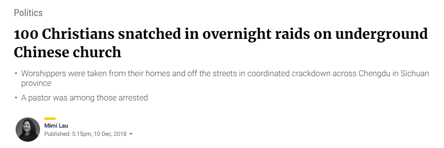
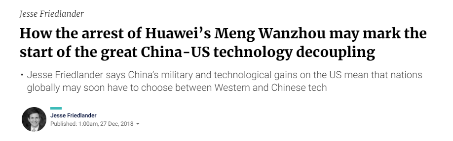

```{r, include=FALSE}
library(tidyverse)
library(dplyr)
```


# Introduction

This is the second article about South China Morning Post (SCMP) Social Network Analysis, and in this post it is going to be cover the step by step of our approach to the Topic Modeling, including data treatment, basic analysis and visualizations and the model development. 
Hope you find this article useful and please let me know your feedbacks!

# Data

To develop our topic model, we used the Twitter data extracted using the Twitter API and [rtweet](https://cran.r-project.org/web/packages/rtweet/rtweet.pdf) package in R. This post will not cover Twitter API setup and data extraction details, but you can find some useful references in the `reference` section of this document.<br>

Since our goal with this analysis is to understand each tweet content, there is no need to consider posts engagement. For instance, if we consider engagement in a case where some specific tweet is heavily re-tweeted in the network without any comment added, this tweet would be repeated in our data several times, but in the end the post content is the same and we would end up with the same identified topic for that case. That's why it is not necessary to consider the engagement in this case, in fact it would only increase our processing time. 

Below, you can see a sample from the data (scmp_full_filtered) that it is going to be used in this analysis:   
- *user_id:* Unique user identifier generated by twitter <br>
- *status_id:* This code identifies each single tweet in data <br>
- *created_at:* Tweet post date <br>
- *text:* Tweet text <br>
- *source:* Identifies from which source the tweet was posted <br>
- *location:* User location <br>
- *extraction:* Identifies our extraction (December 20th, December 25th and January 1st) <br>
- *week:* Derived from the variable "created_at", it identifies the week of the year of each post. <br>

```{r, include=FALSE}
setwd("C:/Users/gcmou/Documents/HKU_MSBA/09-MSBA7012/articles")
scmp_full <- read.csv("SCMPNews_full.csv")
scmp_full$created_at <- as.POSIXct(as.character(levels(scmp_full$created_at)), format = "%Y-%m-%d %H:%M")[scmp_full$created_at]
scmp_full_filtered <- scmp_full %>% select("user_id", "status_id", "created_at", "text", "screen_name", "source", "location", "extraction") %>% mutate(week = format(created_at,'%U'))

theme_SCMP <- theme_classic() +
              theme(text=element_text(size = 9, family = "sans", color = "midnightblue"),
              axis.text.y = element_text(colour = "gray48"),
              axis.text.x = element_text(colour = "gray48"))


```

```{r, message = FALSE, warning=FALSE}
library(tidyverse)
library(dplyr)

glimpse(scmp_full_filtered)
```

# Exploratory Analysis 

Before diving into the modeling part, I'm going to show some basic analysis to further understanding about the data.

## Basic Analysis

In this analysis we want to show some users characteristics related to the total number of tweets, location, activity per day of week and posting mode.<br>
The following visualization uses "ggplot2" and "ggpubr" packages. Besides that, the "theme_SCMP" was created to standardize the graphs easily.<br>

```{r, warning=FALSE, message=FALSE, fig.align= "center"}
library(ggplot2)
library(ggpubr)

#top users
user <- scmp_full_filtered %>% mutate(SCMP = case_when(user_id == "x23922797" ~ "Top1"
                                            ,user_id == "x753571509080174592" ~ "Top2"
                                            ,user_id == "x2181603019" ~ "Top3"
                                            ,user_id == "x796377107148447744" ~ "Top4"
                                            ,user_id == "x754430965737488384" ~"Top5"
                                            ,user_id %in% c("x1040992571219038208" 
                                                            ,"x347568180" 
                                                            ,"x39221283" 
                                                            ,"x1015999919566434304" 
                                                            ,"x822305327072710658") ~ "Top6-10"
                                            ,user_id != c("x23922797" 
                                                          ,"x753571509080174592"
                                                          ,"x2181603019"
                                                          ,"x796377107148447744" 
                                                          ,"x754430965737488384"
                                                          ,"x1040992571219038208" 
                                                          ,"x347568180" 
                                                          ,"x39221283" 
                                                          ,"x1015999919566434304" 
                                                          ,"x822305327072710658") ~ "Others")
                                     )
user <- user %>% group_by(SCMP) %>% summarise(number_tweets = n())
user_plot <- ggplot(user, aes(x = factor(SCMP), y = number_tweets)) +
            geom_bar(stat = "identity", position = "dodge", fill="darkgoldenrod1") +
            labs(title = 'Tweets SCMP vs. Others', x = '', y = "Number of Tweets") + 
            theme_SCMP
user_plot <- user_plot + theme(plot.title = element_text(size = 11, hjust = 0.5))


#day of week
week <- scmp_full %>% mutate(day_week = format(created_at,'%w'))
week <- week %>% group_by(day_week) %>% summarise(n = n())
week$day_week <- as.numeric(week$day_week)
week <- week %>% mutate(weekday = case_when (day_week == 0 ~ "7.Sun"
                                    ,day_week == 1 ~ "1.Mon"
                                    ,day_week == 2 ~ "2.Tue"
                                    ,day_week == 3 ~ "3.Wed"
                                    ,day_week == 4 ~ "4.Thu"
                                    ,day_week == 5 ~ "5.Fri"
                                    ,day_week == 6 ~ "6.Sat")
                        ,total = case_when(day_week == 0 ~ (n/3)
                                    ,between(day_week,1,2) ~ (n/4)
                                    ,between(day_week,3,6) ~ (n/3)))
weekday_plot <- ggplot(week, aes(x = factor(weekday), y = total)) +
            geom_bar(stat = "identity", position = "dodge", fill="darkgoldenrod1") +
            labs(title = 'Average Tweets per day', x = '', y = "Avg tweets per day") + 
            theme_SCMP
weekday_plot <- weekday_plot + theme(plot.title = element_text(size = 11, hjust = 0.5))


#location
location <- scmp_full %>% filter(location != "")
location_plot <- location %>%
      count(location, sort = TRUE) %>%
      mutate(location = reorder(location, n)) %>%
      top_n(10) %>%
      ggplot(aes(x = location, y = n)) +
      geom_col(fill = "darkgoldenrod1") +
      coord_flip() + 
      labs(x = "", y = "number of tweets", title = "Top 10 locations") +
      theme_SCMP
location_plot <- location_plot + theme(plot.title = element_text(size = 11, hjust = 0.5))


#source
source <- scmp_full %>% mutate(source2 = case_when(source == "Twitter Web Client" ~ "1.Web"
                                                   ,source == "Twitter for iPhone" ~ "2.iPhone"
                                                   ,source == "Twitter for Android" ~ "3.Android"
                                                   ,source == "Buffer" ~ "4.Buffer"
                                                   ,source == "Twitter Lite" ~ "5.Lite"
                                                   ,source != c("Twitter Web Client" 
                                                                ,"Twitter for iPhone"
                                                                ,"Twitter for Android"
                                                                ,"Buffer"
                                                                ,"Twitter Lite") ~ "6.Outros"))
source <- source %>% group_by(source2) %>% summarise(total = n())
source_plot <- ggplot(source, aes(x = factor(source2), y = total)) +
            geom_bar(stat = "identity", position = "dodge", fill="darkgoldenrod1") +
            labs(title = 'Tweets per source', x = '', y = "Total") + 
            theme_SCMP
source_plot <- source_plot + theme(plot.title = element_text(size = 11, hjust = 0.5))


#plot
ggarrange(user_plot, weekday_plot, location_plot, source_plot, ncol = 2, nrow = 2)

```

- Tweets SCMP vs. Others: As expected, the top 1 user is South China Morning Post profile (@SCMPnews)! As we saw in the first article, SCMP has a high centrality in this network and seems natural that it would be the top 1 in number of tweets. Their profile itself is responsible for 11.44% of all tweets in this data and when summed up to the following top 9 users, it reaches 4.026 tweets or 15.8% of total tweets. In fact, their behavior is very different from the other users, but still have a considerable number of tweets from the remainder users.<br> 
- Average tweets per day: This graph shows that in this network, the users tend to post more during the week days than during the weekends. <br>
- Top 10 Locations: Hong Kong is by far the most popular location in this network, which makes sense since SCMP is a local newspaper. At the same time, there are locations from different parts of the world (not only Asia) in the top 10 list, and as said in the first article, SCMP has developed a strategy to increase its brand presence worldwide in recent years, so it seems that they are doing a great job on it. <br>
- Tweets Source: In this graph we wanted to understand a little bit about the customer usage habits and we can see that Web followed by the app versions are the principal channels used for tweeting. <br>


## Basic Text analysis

Starting from this session, I'm going to tackle the content analysis and the first step to perform this task it is text cleanning, as follows:

```{r, message = FALSE, warning=FALSE}
library(tidytext)

scmp_full_filtered <- scmp_full_filtered %>% arrange(created_at)
words <- scmp_full_filtered %>% select(status_id, text, created_at)

#remove site addresses
words$stripped_text <- gsub('http.*','',  words$text)
words$stripped_text <- gsub('https.*','', words$stripped_text)
#remove any thing that is not a commun letter or ponctuation
words$stripped_text <- gsub('[^\x20-\x7E]', '', words$stripped_text)
words$stripped_text <- gsub('youre', '', words$stripped_text)
words$stripped_text <- gsub('[[:digit:]]', '', words$stripped_text)

```

The expression `[^\x20-\x7E]` stands for removing all characters besides commun letter or ponctuation. If you take a look on the [ASCII table](http://www.asciitable.com/), this line code removes any character that doesn't lie between 0x20 and 0X7E.<br>
I also decided to remove "youre" because it was appearing several times in data and it was interfering on the interpretability in the following steps.
Next, we need to remove all the 'stop words' and separate each word of our cleaned text for performing the following analysis.

```{r, message = FALSE}
words2 <- words %>%
  unnest_tokens(word, stripped_text) %>%
  anti_join(stop_words)

head(words2)
```

### Basic cloud 

Since the most popular visualization for text is the word cloud, coming next you can find some examples applied to SCMP data:  

```{r, message=FALSE, warning= FALSE, fig.align="center"}

library(wordcloud)

words2 <- words2 %>% 
      filter(word != "scmpnews")

words2 %>%
      count(word) %>%
      with(wordcloud(word, n, max.words = 120, rot.per = 0.4, scale=c(4,0.6),
      colors=brewer.pal(7, "Set1")))
```

In this fist visualization we already see some words like "China", "Trade", "War", "Hawaei", "American", "Xi" (that stands for Xi Jinping) pop ups. During the period of our analysis there were many news related to a possible Trade War between China and USA, we will see it with more details later on.

### Bigram

Another approach for basic text analysis is considering the words in pairs instead of considering each of them separately: <br>
   
   
```{r, message=FALSE, warning=FALSE, fig.align="center"}

tweet_bigram <- words %>%
      unnest_tokens(bigram, stripped_text, token = "ngrams", n = 2)

bigrams_separated <- tweet_bigram %>%
      separate(bigram, c("word1", "word2"), sep = " ")

bigrams_filtered <- bigrams_separated %>%
      filter(!word1 %in% stop_words$word) %>%
      filter(!word2 %in% stop_words$word)

# new bigram counts:
bigram_counts <- bigrams_filtered %>% 
      count(word1, word2, sort = TRUE)

bigrams_united <- bigrams_filtered %>%
      unite(bigram, word1, word2, sep = " ")

bigrams_united %>%
      count(bigram, sort = TRUE) %>%
      filter(n > 300) %>%
      mutate(bigram = reorder(bigram, n)) %>%
      ggplot(aes(bigram, n)) +
      geom_col(fill = "midnightblue") +
      xlab(NULL) +
      coord_flip() + 
      labs(title = 'Top Words Pairs', x = ' ', y="Total") + 
      theme_SCMP

```
<br>
To a better understanding about this analysis let me give a little bit of context. During the period of the data extraction there were some hot topics highly published in all kinds of media, like: possible Trade War between China and USA, Arrestment of a Christians group in China and the Huawei's CFO arrestment in Canada. Interestingly words related to those events appear as top pair of words in our analysis. Following, some news headlines from that period which gives more details about the context:<br>
<br>

```{r, fig.align="left", echo=FALSE, fig.cap="US-China Trade War - Source: [SCMP](https://www.scmp.com/economy/china-economy/article/2180149/us-china-trade-war-dominates-scmps-top-10-economy-stories-2018)"}


```
<br>
<br>

```{r, fig.align="left", echo=FALSE, fig.cap="Christians arrestment - Source: [SCMP](https://www.scmp.com/news/china/politics/article/2177263/100-snatched-china-church-raids-overnight)"}



```
<br>
<br>

```{r, fig.align="left", echo=FALSE, fig.cap="Huawei - Source: [SCMP](https://www.scmp.com/comment/insight-opinion/united-states/article/2179520/how-arrest-huaweis-meng-wanzhou-may-mark-start)"}



```
<br>
<br>

Another useful way to visualize the word pairs is using graphs. Particularly, I love this visualization because it shows the relationship with more than one word-pair at the same time in an intuitive and straightforward way. Besides that, the `visNetwork` package helps turning it into a super cool and dynamic visualization!<br>

```{r, message=FALSE, warning=FALSE, fig.align="center"}
library(visNetwork)
library(igraph)
library(ggraph)

bigram_graph <- bigram_counts %>%
  filter(n > 150) %>%
  graph_from_data_frame

edges <- as_data_frame(bigram_graph, what="edges")
names(edges)[names(edges) == 'from'] <- 'from_aux'
names(edges)[names(edges) == 'to'] <- 'to_aux'

nodes <- as_data_frame(bigram_graph, what="vertices")
nodes2 <- cbind(id=as.numeric(factor(nodes$name, levels = nodes$name)), nodes) 

edges2 <- left_join(edges,nodes2,by=c("from_aux"="name"))
names(edges2)[names(edges2) == 'id'] <- 'from'
edges2 <- left_join(edges2,nodes2,by=c("to_aux"="name"))
names(edges2)[names(edges2) == 'id'] <- 'to'


edges2$width <- 5 # line width
nodes2$shape  <- "dot"  
nodes2$label  <- nodes2$name # Node label
nodes2$font <- '40px arial blue'
nodes2$color <- '#ebb400'
nodes2$borderWidth <- 1 # Node border width
edges2$color <- "gray"    # line color  
edges2$arrows <- "from" # arrows: 'from', 'to', or 'middle'

visNetwork(nodes2, edges2, width="100%", height="600px")


```

This graph starts to reveal some basic word groups that seems to be related with some specific topics. For example, the group "xi-revival-trade-war-trump's-toughness" seems to be related to the news about "USA and China Trade War" already mentioned previously in this document. Furthermore, the big group that includes words like "suzannecass-ban_live_export-banliveexport" seems to be related news about protests against animal live exportation (after an ship accident in this period). <br>

### Trend topics

In our previous article, we saw that on the 18th of December we had a peak in the number of tweets. So the following analysis aims to understand if it was any unusual behaviour that day:<br>

```{r, fig.align="center"}
day18 <- words2 %>% filter(format(created_at,'%Y-%m-%d') == "2018-12-18")

day18 %>%
  count(word, sort = TRUE) %>%
  filter(n > 120) %>%
  mutate(word = reorder(word, n)) %>%
  ggplot(aes(word, n)) +
  geom_col(fill = "midnightblue") +
  xlab(NULL) +
  coord_flip() + 
  labs(title = 'Top Words - 18th of December', x = ' ', y="Total") + 
  theme_SCMP

day18 <- day18 %>% filter(word != "scmpnews")
day18 %>%
      count(word) %>%
      with(wordcloud(word, n, max.words = 80, rot.per = 0.4, scale=c(4,0.6),
      colors=brewer.pal(8, "Dark2")))

```


Definitely, we can see that there were some news related to the US and China Trade War that generated more activity and comments in the network at that day. Note that was just shown above, in the news headline example, that the episodes related to this topic dominated the top 10 list of economic stories in 2018 so, we can conclude that this was indeed an important topic and therefore raised users interest in the network.


# Topic Modeling

## Data treatment

Since we don´t know exactly what topics might exist in the data and we don't have any variables with this information for training a supervised learning model, we decided to use a clustering technique to group the posts with similar content and then classify it according to its characteristics.<br>
That being said, the data for this task needs to be prepared. First of all, it is necessary to count each word frequency in data and then transform it into a Document Term Matrix, as follows:

```{r}
word_counts <- words2 %>%
  count(word, sort = TRUE) %>%
  mutate(aux= 1)

word_counts2 <- word_counts %>% 
      filter(word != "scmpnews") %>%
      cast_dtm(aux, word, n) 
```


## Model

For our topic modeling we are going to use the algorithm "Latent Dirichet Allocation" which is a popular and simple approach for this kind of problem. According to Silge et all. (2010) this algorithm "treats each document as a mixture of topics and each topic a mixture of words."
In our study, we decided to follow the simplest approach and consider the whole dataset as one unique document.

```{r, message = FALSE, cache=TRUE, fig.align="center", warning = FALSE}

library(topicmodels)

word_counts3 <- LDA(word_counts2, k = 6, control = list(seed = 1234))
word_counts4 <- tidy(word_counts3, matrix = "beta")
word_counts5 <- word_counts4 %>% group_by(term) %>% summarise(beta = max(beta))
word_counts6 <- left_join(word_counts5, word_counts4, by=c("term"="term", "beta"="beta"))
head(word_counts4)

```


An interesting point about topic models algorithms is that it allows some overlaps within the identified topics, which means that for each work, it is possible to get more than one topic and each of them with different probabilities. The table above illustrates exactly this concept for the word "China". and, as you can see, it has different probabilities for each topic. Note that, the highest one is correspondent to Topic 6. Later on we are going to show that this makes a lot of sense, since we identified that this topic concentrate news related to "Mainland China". 

The following visualization shows the top 10 (in terms of Beta) for each of the topics:


```{r, message = FALSE, cache=TRUE, fig.align="center", warning = FALSE}
top_terms <- word_counts6 %>%
  group_by(topic) %>%
  arrange(topic, -beta) %>%
  top_n(10, beta) %>%
  ungroup() %>%
  arrange(topic, -beta)

top_terms %>% 
      mutate(term = reorder(term, beta)) %>%
      ggplot(aes(term, beta, fill = factor(topic))) +
      geom_col(show.legend = FALSE) +
      facet_wrap(~ topic, scales = "free") +
      coord_flip()

```

## Results:

To come up with a unique topic per tweet, we considered the topic with the highest overall beta as follows:

```{r, warning=FALSE, message=FALSE, cache=TRUE}

library(tm)

#Defining topic to each status_id
scmp_words_status <- left_join(words2, word_counts6, by=c("word"="term"))
scmp_words_status <- scmp_words_status %>% group_by(status_id, topic) %>% summarise(total = n())
scmp_words_status <- scmp_words_status %>% arrange(status_id, desc(total))
scmp_words_status <- subset(scmp_words_status, !duplicated(scmp_words_status[,"status_id"]))

#adding topic to the original data
text <- scmp_full_filtered %>% select(status_id, text)
scmp_words_status2 <- left_join(text,scmp_words_status, by=c("status_id"="status_id"))
scmp_words_status2 <- scmp_words_status2 %>% filter(!is.na(topic))

topic_plot <- scmp_words_status2 %>% group_by(topic) %>% summarise(total = n())
topic_plot2 <- ggplot(topic_plot, aes(x = factor(topic), y = total)) +
            geom_bar(stat = "identity", position = "dodge", fill="midnightblue") +
            labs(title = 'Total tweets per topic', x = '', y = "total") + 
            theme_SCMP
topic_plot2 + theme(plot.title = element_text(size = 11, hjust = 0.5))


```

The final classification obtained a roughly balanced distribution of number of tweets per topic. The one with fewer classified posts is topic 5 with only 2707 posts (10.7% of total tweets).<br>

After all we can now show our final visualization with more details about the content obtained for each of the topics:<br>

```{r, message=FALSE, warning=FALSE, cache=TRUE, fig.align="center"}


#we will need to clean the text again, also removing digits and ponctuations to make the visualization cleaner
scmp_words_status2$stripped_text <- tolower(scmp_words_status2$text)
scmp_words_status2$stripped_text <- gsub('http.*','',  scmp_words_status2$stripped_text)
scmp_words_status2$stripped_text <- gsub('[^\x20-\x7E]', '', scmp_words_status2$stripped_text)
scmp_words_status2$stripped_text <- gsub('[[:punct:]]', '', scmp_words_status2$stripped_text)
scmp_words_status2$stripped_text <- gsub('[[:digit:]]', '', scmp_words_status2$stripped_text)
scmp_words_status2$stripped_text <- gsub('youre', '', scmp_words_status2$stripped_text)
scmp_words_status2$stripped_text <- gsub('rt', '', scmp_words_status2$stripped_text)

scmp_words_status2 <- scmp_words_status2 %>% select(status_id, stripped_text, topic)


topic1 <- scmp_words_status2 %>% filter(topic==1) %>% select(stripped_text)
topic1a = paste(topic1$stripped_text, collapse=" ")

topic2 <- scmp_words_status2 %>% filter(topic==2) %>% select(stripped_text)
topic2a = paste(topic2$stripped_text, collapse=" ")

topic3 <- scmp_words_status2 %>% filter(topic==3) %>% select(stripped_text)
topic3a = paste(topic3$stripped_text, collapse=" ")

topic4 <- scmp_words_status2 %>% filter(topic==4) %>% select(stripped_text)
topic4a = paste(topic4$stripped_text, collapse=" ")

topic5 <- scmp_words_status2 %>% filter(topic==5) %>% select(stripped_text)
topic5a = paste(topic5$stripped_text, collapse=" ")

topic6 <- scmp_words_status2 %>% filter(topic==6) %>% select(stripped_text)
topic6a = paste(topic6$stripped_text, collapse=" ")


all = c(topic1a, topic2a, topic3a, topic4a, topic5a, topic6a)
all = removeWords(all, c(stopwords("english")))


corpus = Corpus(VectorSource(all))
tdm = TermDocumentMatrix(corpus)
tdm = as.matrix(tdm)

# add column names
colnames(tdm) = c("HK News", "International", "USA and China", "Business", "Sports", "Mainland China")

comparison.cloud(tdm, random.order=FALSE,scale=c(4,0.4), 
colors = c("midnightblue", "darkgoldenrod1", "goldenrod4", "dodgerblue3", "gray44",  "darkorange3"),
title.size=0.8, max.words=5000) 

```

- Topic 1 "Hong Kong News": Daily news about Hong Kong. <br>
- Topic 2 "International": News related to the international scenario. With a particular reference to the words "Canadian", "Huawei" that are related to a hot topic at that time about the Huawei's CFO arrestment in Canada. <br>
- Topic 3 "USA and China": The principal content is news related to the USA and China, especially the ones related to the issue "Trade War". <br>
- Topic 4 "Business": News related to business in general. In the cloud above it is possible to identify many words like "Christmas", "Jack Ma", "founder", "employees", "working" which are usually related to business. <br>
- Topic 5 "Sports": News related to sports, pointing out words like "rugby", "Olympics", "Tokyo". It is curious to see "whaling" in this topic, but the reason is that there were some protests against the new Japanese policy regarding whaling and many athletes were considering to boycott the Olympic games in Japan. <br>

```{r, echo=FALSE, fig.align="left", fig.cap="Topic 5 news example - Source [SCMP](https://www.scmp.com/sport/rugby/article/2179912/rugby-world-cup-boycott-japans-whaling-return-sparks-rumblings-protests)"}


```

- Topic 6 "Mainland China": General news about mainland China. <br>
 

# Conclusion

Using this simple topic modeling approach, it was possible to identify 6 different topics in data and remarkably most of them are part of the SCMP classification in its website. If you check their website, you will see that they organize their news into 8 different categories: "Hong Kong", "China", "Asia", "World", "Business", "Economy", "Tech" and "Sports". We were able to identify successfully topics related to "Hong Kong", "China" and "Sports", "Business" seems to be mixed with news related to "Tech" and finally "International" seems to be a mixture of "World" and "Asia" in our study.<br>
Surprisingly, we were able to identify one exclusive cluster for "US and China Trade War" and since it dominated the top 10 economy stories in 2018, this separation seems to make sense due to the extraction period of our data. <br>
One recommendation for further improvement in this model is increase the data size, by extracting data for a longer period. With this done, I expect that the identified topics will converge to the classification which SCMP uses in their website.<br>

# References

* Seting up Twitter API:<br> 
      + https://towardsdatascience.com/access-data-from-twitter-api-using-r-and-or-python-b8ac342d3efe <br>
      + https://www.earthdatascience.org/courses/earth-analytics/get-data-using-apis/use-twitter-api-r/ <br>
* ASCII table: http://www.asciitable.com/ 
* Silge, J. and Robinson, D., 2010. Text mining with R https://www.tidytextmining.com/
* Gaphs visualization http://kateto.net/network-visualization

